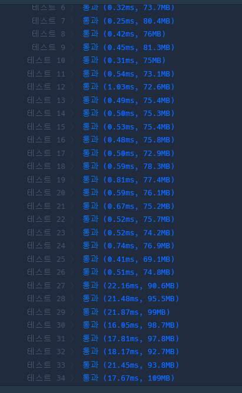

# 2024-06-16

## 프로그래머스 42885. 구명보트
두 원소의 값이 weight보다 작거나 같은지 확인하는 문제.<br>
먼저, 주어지는 배열을 오름차순으로 정렬하였다.<br>
<br>
처음은, 매우 그리디하게 해결하려고 하였다.<br>
예를 들어, 배열이 [50, 70, 80, 50]이며 제한 weight가 100이라고 하였을 때<br>
배열을 [50, 50, 70, 80]으로 오름차순으로 하여,<br>
순차적으로 50과 50, 그리고 70, 80 을 비교하는 방식으로 해결하려고 하였지만 이는 오답이었다.<br>
<br>
아이디어가 떠오르지 않아 결국 다른 사람의 풀이를 확인하였고, 그 중 하나가 "**투 포인터**" 였다.<br>
<span style="color:#FF4B4B">
참고로 투 포인터의 시간 복잡도는 *O(n)* 이다. </span>

### 투 포인터를 적용할 수 있는 문제의 유형
* 부분 배열 또는 부분 리스트 찾기
* 두 요소의 합 찾기
* 정렬된 배열의 특정 합 찾기

## 프로그래머스 12985. 예상 대진표
세그먼트 트리를 활용하여 문제를 해결하였다.<br>

<details>
<summary>이전 코드 보기</summary>
<br>

```java

class Solution
{
    class Node {
        int min, max;
        
        public Node(int min, int max){
            this.min = min;
            this.max = max;
        }
        
        boolean contains(int n){
            return min <= n && n <= max;
        }       
    }
    
    public int solution(int n, int a, int b)
    {
        int answer = 0;
        int idx = 1;
        int max_height = (int)log2(n);
        Node[] tree = new Node[n * 4 + 1];
        tree[1] = new Node(1, n);
        
        for(int i = 1; i <= n * 4; i++){
            if(tree[i] != null && tree[i].contains(a) && tree[i].contains(b)){
                idx = i;
                int min = tree[i].min, max = tree[i].max;
                tree[i*2] = new Node(min, (min + max)/2);
                tree[i*2 + 1] = new Node((min + max)/2 + 1, max);
            }
        }
        
        return max_height - (int)log2(idx);
    }
    
    double log2(int n){
        return Math.log(n) / Math.log(2);
    }
}
```
</details>
<br>
<br>
최대 22.16ms고, 메모리의 경우 109MB가 나온 것을 확인하였지만 이를 좀 더 개선하고 싶었다.<br>
먼저, 위의 코드에서 for문을 queue으로 대체하였다.<br>
또한 '굳이 배열을 써야할까?' 라는 의문을 가져 배열을 사용하지 않는 방향으로 바꾸었다.<br>
<br>
이후 다른 사람의 풀이를 보고 조금 벙찐 느낌...<br>
<details>
<summary>code 보기</summary>
<br>

```java
class Solution
{
    public int solution(int n, int a, int b)
    {
        return Integer.toBinaryString((a-1)^(b-1)).length();
    }
}
```
</details>

## 프로그래머스 12914. 멀리 뛰기
효진이는 1칸 혹은 2칸만 뛸 수 있다..<br>
n칸 이동하는 경우 = (n-2)칸 이동하는 경우 + (n-1)칸 이동하는 경우
로 볼 수 있으므로 이를 적용하였다.<br>
